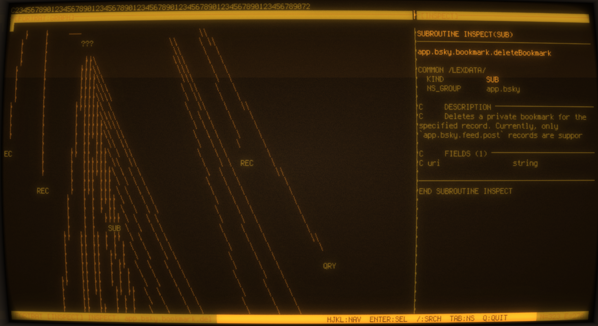
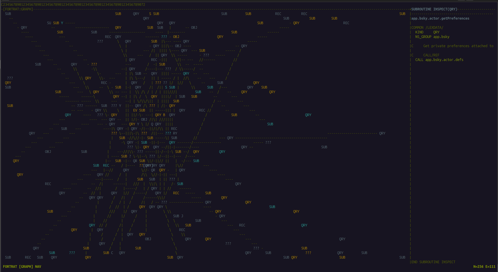

# FORTRAT-F90

**AT Protocol lexicon explorer — written in Fortran**




---

## So what is this?

FORTRAT-F90 is a terminal application that fetches the AT Protocol lexicon schema from GitHub, builds a force-directed graph of all record types and their references, and renders it as ASCII art in your terminal.

It is written in Fortran. And if you run it, it's running wild :) Still early

Not "inspired by Fortran". Not "has some Fortran vibes". Written in Fortran. The HTTP requests are Fortran. The JSON parsing is Fortran. The force simulation is Fortran. The ASCII renderer is Fortran. The terminal raw mode is a 40-line C helper because `tcsetattr` is a POSIX syscall and we are not animals.

```
./fortrat
```

That is a Fortran binary talking to the AT Protocol.

---

## Why?

[Fortransky](https://github.com/FormerLab/fortransky) — our FORTRAN 77 Bluesky client — shipped a few days before Atmosphere 2026. The AT Proto crowd found out that someone had written a Bluesky client in a language from 1957. This was considered funny. We considered it a mandate :)

FORTRAT-F90 is the follow-up, our in-house AT Proto lexicon explorer, now open sourced. If Fortransky proved you *could* post to Bluesky from Fortran, FORTRAT-F90 proves you can also explore the entire AT Protocol schema from Fortran while watching a force simulation settle in real time.

The name is FORTRAN + AT Protocol. FORTRAN identifiers were limited to 6 characters. We used 6. We showed restraint.

---

## What you are looking at

The AT Protocol defines every data type on the network in a schema system called **lexicons**. A post is a lexicon. A like is a lexicon. A follow, a label, a moderation action — all lexicons, all formally specified in JSON, all living in the [atproto repository](https://github.com/bluesky-social/atproto/tree/main/lexicons).

FORTRAT-F90 fetches all of them, builds a graph where nodes are lexicon types and edges are references between them, and renders it. The dense blue-green cluster in the middle is `app.bsky.*`. The orbiting yellow nodes are `com.atproto.*`. The purple ones are `tools.ozone.*`. The force simulation pulls related types together and pushes unrelated ones apart, so the layout roughly reflects the actual structure of the protocol.

Nodes show their actual lexicon name — `post`, `like`, `follow`, `getProfile`. The simulation settles after a few seconds and the graph holds still.

---

## Architecture

Everything is Fortran. The exception is noted with appropriate shame.

```
src/types.f90       — all shared types, ANSI escape constants
src/tui.f90         — terminal control (ISO C binding → C helper)
src/tui_helper.c    — 60 lines of C (tcsetattr, write, ioctl — we tried)
src/simulate.f90    — force-directed simulation, pure Fortran math
src/render.f90      — ASCII grid renderer, Bresenham lines, frame buffer
src/fetch.f90       — HTTP (ISO C binding → libcurl)
src/lexparse.f90    — JSON (json-fortran), graph builder
src/main.f90        — event loop, state machine
```

The renderer builds the entire frame into a Fortran allocatable array and sends it to C in a single `write()` call. This is how we avoid flicker. It works.

---

## Build

### Dependencies

```bash
# Arch / Garuda
sudo pacman -S gcc-fortran curl cmake git

# Ubuntu / Debian
sudo apt install gfortran libcurl4-openssl-dev cmake git
```

### Build

```bash
make
```

The Makefile clones and builds [json-fortran](https://github.com/jacobwilliams/json-fortran) into `vendor/` automatically on first run. Subsequent builds skip this step.

```bash
./fortrat
```

Allow 2-3 minutes for the initial lexicon fetch (~256 files from GitHub's CDN). After that it runs locally.

---

## Controls

| Key | Action |
|-----|--------|
| `hjkl` / arrows | Navigate between nodes |
| `Enter` | Inspect selected node |
| `Esc` | Deselect |
| `/` | Search lexicons |
| `Tab` | Toggle namespace visibility |
| `c` | Toggle community lexicons |
| `q` | Quit |

---

## Recommended terminal size

120×40 minimum. The wider the better. The graph breathes at 200+ columns.

Works in cool-retro-term (phosphor green preset, obviously) and in any modern terminal. The screenshots from cool-retro-term looked better. The screenshots from a normal terminal are more readable. Both are valid choices and we will not judge you.

---

## Relation to Fortransky

[Fortransky](https://github.com/FormerLab/fortransky) is a FORTRAN 77 Bluesky client. It posts. It reads timelines. It has a Rust decoder for the firehose and an x86-64 assembly decoder for fun. It is arguably the most over-engineered Bluesky client in existence...

FORTRAT-F90 is Fortran 2018. It uses allocatable strings, `iso_c_binding`, and modern modules. By comparison it is practically contemporary software.

Both are part of the FormerLab sovereign computing ecosystem, which is a fancy way of saying we build things that have no business existing and then release them anyway.

---

## Known limitations

- GitHub's unauthenticated API is rate-limited to 60 requests/hour. If the fetch fails, wait an hour or set a `GITHUB_TOKEN` in a proxy.
- The force simulation is O(n²). With 256 nodes it runs fine. With 2000 nodes it would not.
- The JSON parser is the excellent [json-fortran](https://github.com/jacobwilliams/json-fortran) by Jacob Williams. Without it this project would have required writing a JSON parser in Fortran, which we were prepared to do but preferred not to.
- `tui_helper.c` exists. We know.

---

## FormerLab

[formerlab.eu](https://formerlab.eu)

Building things that have no business existing since whenever this started.

FORTRAT = FORTRAN + AT Protocol. Six characters. We counted.